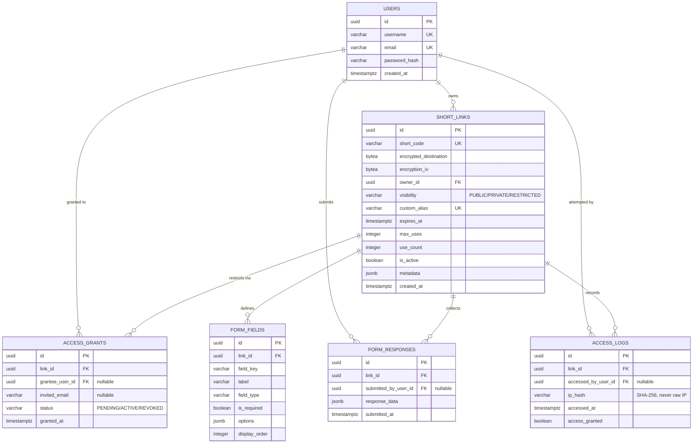
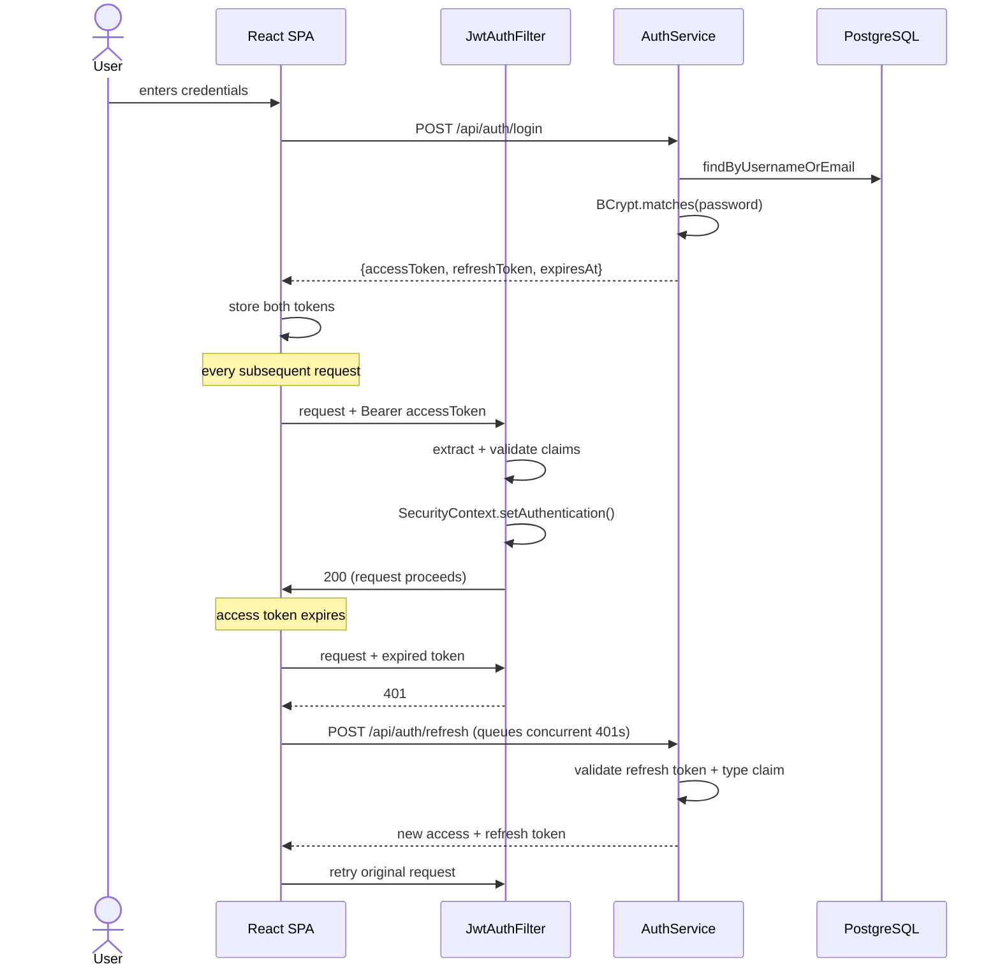
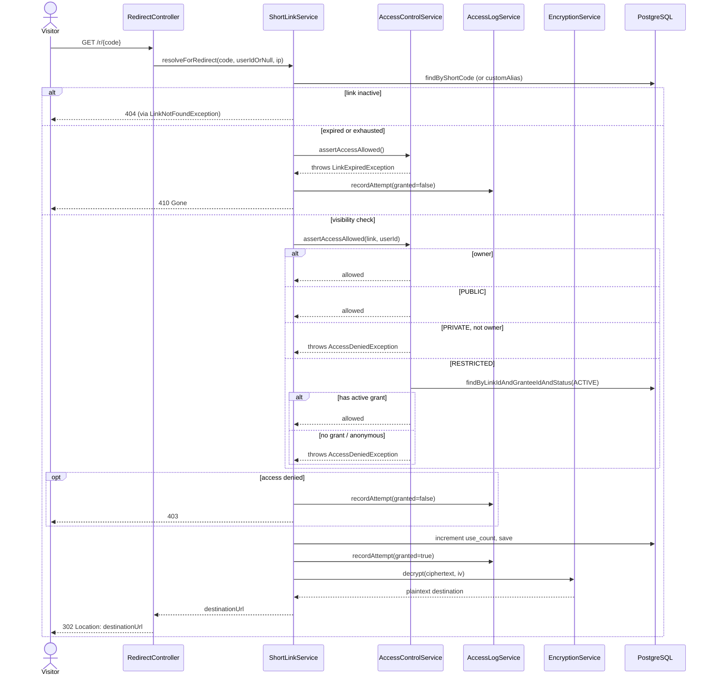
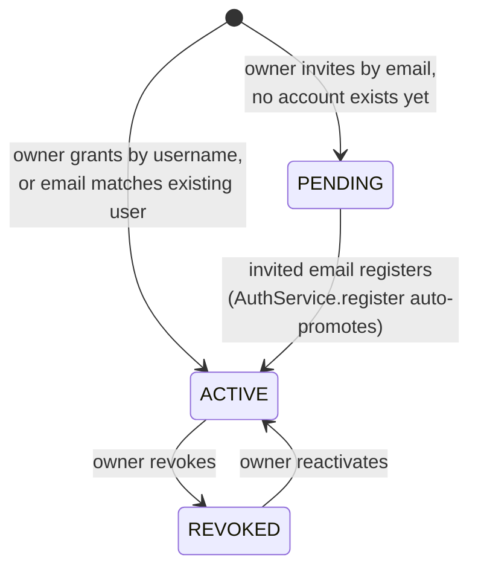
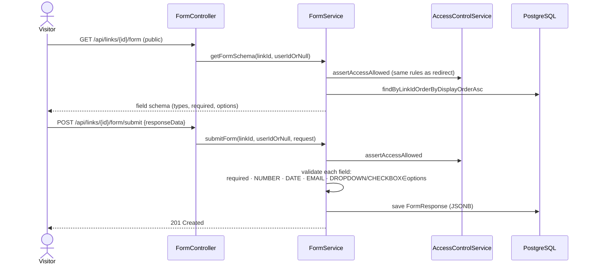

# Shortner

An encrypted URL shortener where the link owner  not the platform  decides who can actually use each link. Every destination URL is encrypted at rest, visibility is enforced per-link (public, private, or an explicit allow-list), and owners can attach a custom data collection form that visitors fill out before being redirected.

Built as a Spring Boot backend with a React/Vite frontend.

---

## What it does

- **Encrypted by default** — every destination URL is stored as AES-256-GCM ciphertext with a per-link IV, never as plaintext. Even direct database access doesn't reveal where a link points.
- **Three visibility levels**
  - `PUBLIC` — anyone with the short URL can use it
  - `PRIVATE` — only the owner can use it
  - `RESTRICTED` — only people the owner explicitly grants access to, either by username (existing users) or by email invite (pending until they register)
- **Custom aliases, expiry, and use limits** — pick a memorable slug, set an expiration timestamp, and/or cap how many times a link can be used
- **Dynamic forms per link** — attach a custom form (text, number, email, date, dropdown, checkbox fields) that visitors fill out, with responses stored and paginated for the owner to review
- **Full access auditing** — every access attempt, granted or denied, is logged with a SHA-256 hash of the visitor's IP — never the raw address
- **JWT authentication** — stateless, Spring Security–backed auth with access + refresh tokens
- **API docs out of the box** — Swagger UI via springdoc-openapi

---

## Tech stack

**Backend**
- Java 21, Spring Boot 4.1 (Spring Framework 7)
- Spring Web, Spring Data JPA, Spring Security
- PostgreSQL, schema managed with Flyway
- JJWT for JWT generation/parsing
- AES/GCM/NoPadding for destination-URL encryption
- BCrypt for password hashing
- springdoc-openapi for Swagger UI
- Lombok
- Docker (multi-stage build — Maven build stage → slim JRE runtime stage)

**Frontend**
- React 19 + Vite 8
- Redux Toolkit + React Redux for state (auth session, links list)
- React Router 8
- Axios, with a shared client that auto-attaches the JWT and redirects to login on 401
- Tailwind CSS v4, with a custom design system built around a warm ink-on-off-white palette and monospace short codes
- `@` path alias (`@/components/...` instead of relative imports)

**Infra**
- PostgreSQL via Docker Compose locally, Neon in production
- Backend deployed on Render, frontend on Vercel

---

## How redirects actually work

A plain browser navigation (typing a URL, clicking a raw `<a href>`) can never carry a `Bearer` token — browsers only attach custom headers to requests made by page JavaScript, not to normal navigation. So:

- **`GET /r/{code}`** (backend, `RedirectController`) — a real HTTP 302 redirect. Works great for `PUBLIC` links accessed directly, but any request here is effectively anonymous, so `PRIVATE`/`RESTRICTED` links can never resolve through this path for a logged-in user.
- **`GET /api/links/resolve/{code}`** (backend, `ShortLinkController`) — the JSON counterpart. Meant to be called by the frontend's own Axios client, which *does* attach the JWT. Returns the destination as JSON so the frontend can redirect the browser itself once access is confirmed.
- **`/r/:code`** (frontend, `RedirectResolverPage`) — this is what short links actually point to. It calls `/api/links/resolve/{code}` with the user's token (if any), then does `window.location.replace(...)` once it gets a destination back. `PUBLIC` links resolve instantly either way; `PRIVATE`/`RESTRICTED` links only work through this page.

---

## Project structure

```
Backend/
└── src/main/
    ├── java/com/shortner/
    │   ├── config/          # SecurityConfig, JwtAuthFilter, EncryptionConfig, OpenApiConfig, PasswordEncoderConfig
    │   ├── controller/       # AuthController, ShortLinkController, RedirectController, AccessGrantController, FormController
    │   ├── dto/
    │   │   ├── auth/         # LoginRequest, RegisterRequest, AuthResponse
    │   │   ├── form/         # FormFieldRequest, FormSchemaResponse, FormSubmissionRequest
    │   │   └── link/         # CreateLinkRequest, UpdateLinkRequest, LinkResponse, GrantAccessRequest, GrantResponse, ResolveLinkResponse
    │   ├── entity/           # User, ShortLink, LinkAccessGrant, FormField, FormResponse, AccessLog, enums
    │   ├── exception/        # GlobalExceptionHandler + custom exceptions
    │   ├── repository/       # Spring Data JPA repositories
    │   ├── security/         # JwtService, UserPrincipal, CustomUserDetailsService, SecurityUtils
    │   ├── service/          # AuthService, ShortLinkService, AccessControlService, EncryptionService, FormService, ...
    │   ├── util/              # IpHashUtil
    │   └── UrlShortnerApplication.java
    └── resources/
        ├── application.yml
        ├── application-dev.yml
        ├── application-prod.yml
        └── db/migration/      # V1–V6 Flyway migrations
Dockerfile
docker-compose.yml
pom.xml

Frontend/
└── src/
    ├── api/                  # axiosClient, authApi, linksApi, grantsApi, formApi
    ├── assets/
    ├── components/
    │   ├── layout/            # Navbar, ProtectedRoute
    │   ├── links/              # CreateLinkForm, LinkCard, GrantAccessModal
    │   └── ui/                 # Button, Card, Input, Badge
    ├── hooks/                 # useAuth
    ├── pages/                 # HomePage, LoginPage, RegisterPage, DashboardPage, LinkDetailPage, FormBuilderPage, PublicFormPage, RedirectResolverPage
    ├── store/                 # store, authSlice, linksSlice
    ├── App.jsx
    ├── index.css
    └── main.jsx
index.html
jsconfig.json
package.json
vite.config.js
```

---

##  High-Level Architecture

**two redirect paths (`/r/{code}` vs `/api/links/resolve/{code}`):** a plain browser navigation (typing/clicking a link) can never attach a custom `Authorization` header browsers don't do that for normal navigation. So `/r/{code}` works for PUBLIC links only when access needs no token. The SPA calls `/resolve/{code}` via axios instead, which *does* attach the JWT, so PRIVATE/RESTRICTED links can be resolved for a logged-in owner/grantee, with the frontend performing the actual `window.location` redirect once access is confirmed. Both paths funnel into the same `ShortLinkService.resolveForRedirect()` there's exactly one access-control code path, not two.

## Database Design
 
###  Entity-Relationship Diagram
 

 
### Key schema decisions
 
**Encrypted destination, not just access-gated.** `encrypted_destination` (AES-256-GCM ciphertext) + `encryption_iv` are stored as separate `BYTEA` columns rather than one field, because GCM needs a fresh 96-bit IV per encryption and it must travel with the ciphertext to decrypt. A raw DB dump never reveals where any link points — visibility rules protect *access*, encryption protects *confidentiality*, and they're deliberately independent layers.
 
**Grants support invite-before-registration.** `access_grants.grantee_user_id` is nullable and `invited_email` fills the gap: `CHECK (grantee_user_id IS NOT NULL OR invited_email IS NOT NULL)` enforces that one of the two is always present. This lets an owner share a restricted link with someone who hasn't signed up yet  the grant sits `PENDING`, and `AuthService.register()` promotes any matching pending grants to `ACTIVE` the moment that email registers.
 
**Forms are schema-on-write, data-as-JSONB.** `form_fields` defines the schema (key, label, type, required, options) as real rows so it can be validated and rendered; `form_responses.response_data` stores the actual submitted values as `JSONB` keyed by `field_key`. This avoids an EAV (entity-attribute-value) table explosion for arbitrary form shapes while keeping the schema itself relational and constrainable  e.g. `UNIQUE(link_id, field_key)` prevents duplicate keys per form.
 
**Partial index for the security relevant query.** `idx_access_logs_denied ON access_logs(link_id, access_granted) WHERE access_granted = false` an owner's "who's been trying and failing to access my link" view only ever filters on denied attempts, so the partial index stays small and fast even as the full log grows unbounded.
 
**GIN indexes on JSONB columns** (`short_links.metadata`, `form_responses.response_data`) support future filtering/search on semi-structured fields without a full table scan.
 
**`ON DELETE CASCADE` from short_links downward, `ON DELETE SET NULL` for the user reference on responses/logs.** Deleting a link should clean up everything scoped to it (grants, fields, responses, logs). Deleting a *user*, though, shouldn't retroactively corrupt historical form submissions or access logs  those rows survive with `submitted_by_user_id`/`accessed_by_user_id` set to `NULL`, preserving the audit trail.
 
**Flyway owns the schema; Hibernate only validates.** `ddl-auto: validate` in both dev and prod entity/migration drift fails fast at startup instead of Hibernate silently "fixing" the schema. Every change is a numbered, reviewable `V{n}__description.sql` migration.
 
---
 
## Application Architecture
 
###  Layered structure

```mermaid
flowchart LR
    subgraph L1["Controller Layer"]
        direction TB
        C1[AuthController]
        C2[ShortLinkController]
        C3[RedirectController]
        C4[AccessGrantController]
        C5[FormController]
    end
 
    subgraph L2["Service Layer — business rules"]
        direction TB
        S1[AuthService]
        S2[ShortLinkService]
        S3[AccessControlService]
        S4[AccessLogService]
        S5[FormService]
        S6[EncryptionService]
        S7[ShortCodeGeneratorService]
    end
 
    subgraph L3["Repository Layer — Spring Data JPA"]
        direction TB
        R1[(UserRepository)]
        R2[(ShortLinkRepository)]
        R3[(LinkAccessGrantRepository)]
        R4[(FormFieldRepository)]
        R5[(FormResponseRepository)]
        R6[(AccessLogRepository)]
    end
 
    L1 --> L2 --> L3
    S2 -.uses.-> S3
    S2 -.uses.-> S4
    S2 -.uses.-> S6
    S2 -.uses.-> S7
    S5 -.uses.-> S3
```
 

 
Every controller is a thin adapter: extract the caller's identity via `SecurityUtils`, delegate to a service, map the result to a DTO. All authorization logic (ownership checks, visibility rules, grant checks) lives in `AccessControlService` — one place, reused by both the redirect path and the form path, rather than duplicated per-controller.
 
###  Authentication flow (JWT, stateless)
 

 
**Why a `type` claim inside the JWT itself:** `JwtService` embeds `"type": "access"` or `"type": "refresh"` in the token payload. `JwtAuthFilter` explicitly rejects a refresh token used as an access token (`!jwtService.isRefreshToken(token)`) otherwise a leaked refresh token (long-lived) could be replayed directly against protected endpoints instead of only the `/refresh` endpoint.
 
**Why the filter swallows exceptions instead of rejecting the request itself:** a malformed/expired/tampered token just leaves the security context unauthenticated and calls `filterChain.doFilter()` anyway it doesn't short-circuit with a 401 from inside the filter. That lets Spring Security's `authorizeHttpRequests` rules (which already know which paths are public) make the actual authorization decision, so a bad token on a public endpoint (e.g. `/r/{code}`) doesn't wrongly block an anonymous visitor.
 
### Redirect resolution the core access-control decision
 

 
**Why access logging runs in `Propagation.REQUIRES_NEW`:** `AccessLogService.recordAttempt()` opens its own transaction, independent of the caller's. A logging failure must never roll back or block the actual redirect decision, and conversely the redirect's own transaction rolling back (rare, but possible) shouldn't erase the fact that an attempt happened. Logging is best-effort telemetry; access control is not.
 
**Why ownership checks happen at the query, not after fetch-then-compare:** `findByIdAndOwnerId(id, ownerId)` returns empty (→ 404) if the link exists but belongs to someone else a caller can't distinguish "doesn't exist" from "exists but isn't yours" by response shape, which avoids leaking link existence to non-owners on write paths.
 
### Access grant lifecycle (invite-by-email)
 

 
When `AuthService.register()` creates a new user, it queries `findByInvitedEmailAndStatus(email, PENDING)` and promotes every matching grant to `ACTIVE`, attaching the new `grantee_user_id` so an invite sent before someone signs up resolves automatically the moment they do, with no separate "claim invite" step required from the user.
 
### Dynamic form submission
 

 
A form inherits its link's visibility rules the same `AccessControlService.assertAccessAllowed()` gates both redirect and form access, so a RESTRICTED link's form isn't accidentally more or less exposed than its redirect target. Server-side validation (`FormService.validateSubmission`) is authoritative; the React form mirrors the same rules client-side purely for instant feedback, never as the actual gate.
 
## Data model

Six Flyway-versioned migrations build up the schema:

| Migration | Table | Purpose |
|---|---|---|
| `V1` | `users` | Accounts — username, email, BCrypt password hash |
| `V2` | `short_links` | The links themselves encrypted destination + IV, visibility, custom alias, expiry, use limits, JSONB metadata |
| `V3` | `access_grants` | Per-user or per-email access grants for `RESTRICTED` links (`PENDING`/`ACTIVE`/`REVOKED`) |
| `V4` | `form_fields` | Custom form field definitions attached to a link |
| `V5` | `form_responses` | Submitted responses to a link's form, stored as JSONB |
| `V6` | `access_logs` | Every access attempt, hashed IP, whether it was granted |

Notable design choices baked into the schema:
- `short_links.encrypted_destination` / `encryption_iv` are `BYTEA` the destination is never queryable as plaintext
- `metadata` and `response_data` are `JSONB` with GIN indexes
- `access_logs` has a partial index on denied attempts specifically, for a fast "show me who was blocked" query
- Foreign keys cascade sensibly (deleting a user cascades to their links; deleting a link cascades to grants/fields/responses/logs)

---

## API overview

**Auth** (`AuthController`)
| Method | Endpoint | Description |
|---|---|---|
| POST | `/api/auth/register` | Create an account |
| POST | `/api/auth/login` | Log in, returns access + refresh tokens |

**Links** (`ShortLinkController`, `RedirectController`)
| Method | Endpoint | Description |
|---|---|---|
| POST | `/api/links` | Create a short link |
| GET | `/api/links` | List your links (paginated) |
| GET | `/api/links/{id}` | Get one of your links |
| PATCH | `/api/links/{id}` | Update visibility, expiry, max uses, active state, metadata |
| DELETE | `/api/links/{id}` | Delete a link |
| GET | `/api/links/resolve/{code}` | Resolve a code/alias to its destination (JSON, auth-aware) |
| GET | `/r/{code}` | Public HTTP redirect (302) |

**Access grants** (`AccessGrantController`, for `RESTRICTED` links)
| Method | Endpoint | Description |
|---|---|---|
| POST | `/api/links/{linkId}/grants` | Grant access by username or invite by email |
| GET | `/api/links/{linkId}/grants` | List everyone with access |
| DELETE | `/api/links/{linkId}/grants/{grantId}` | Revoke access |
| POST | `/api/links/{linkId}/grants/{grantId}/reactivate` | Re-grant previously revoked access |

**Forms** (`FormController`)
| Method | Endpoint | Description |
|---|---|---|
| POST | `/api/links/{linkId}/form` | Owner: define/replace the form's fields |
| GET | `/api/links/{linkId}/form` | Public: get the form schema |
| POST | `/api/links/{linkId}/form/submit` | Public: submit a response |
| GET | `/api/links/{linkId}/form/responses` | Owner: paginated view of submissions |

---

## Security notes

- Destination URLs are encrypted with AES-256-GCM, a fresh IV per encryption — the key is validated at startup to be exactly 32 bytes, failing fast rather than throwing a cryptic error on first use
- Visitor IPs in `access_logs` are SHA-256 hashed, never stored raw
- JWTs are signed with HS256, requiring a minimum 256-bit secret
- Authorization is grant-based, not role-based — every authenticated user has the same baseline role; access to a specific `RESTRICTED` link is controlled entirely through `access_grants`, checked centrally in `AccessControlService` rather than being re-implemented per endpoint
- Login failures return a deliberately generic message ("Invalid username/email or password") so the API never confirms which part was wrong
- Production error responses omit stack traces and internal messages (`application-prod.yml`)

---

## Known gaps

- **Refresh tokens aren't actually used yet.** `AuthResponse` issues a `refreshToken` and the frontend stores it, but there's no `/api/auth/refresh` endpoint — `axiosClient`'s 401 handler just clears storage and sends the user back to login instead of silently refreshing.
- **Pending email invites don't auto-activate on registration.** `LinkAccessGrantRepository.findByInvitedEmailAndStatus(...)` exists specifically to attach pending grants when an invited email signs up, and the code comments describe this flow — but `AuthService.register()` doesn't currently call it. An invited user who registers still needs the grant reactivated manually.
- **`application.yml` has a YAML formatting bug:**
  This parses as a literal key rather than `port` mapped to `${PORT:8081}`, which can prevent the app from binding to Render's injected `$PORT` correctly. Should be `port: ${PORT:8081}`.
- **`ProtectedRoute` is a UI-only gate.** It just prevents rendering an authenticated page for a logged-out user; the real enforcement is `SecurityConfig`'s `anyRequest().authenticated()` on the backend, as noted in the component's own comments worth keeping in mind if extending it.

---

## Roadmap

- [ ] Implement `/api/auth/refresh` and wire up silent token refresh on the frontend
- [ ] Auto-attach pending email grants on registration
- [ ] Rate limiting on redirect/resolve endpoints using the hashed-IP data already being collected
- [ ] Email delivery for pending invites (currently just sits `PENDING` with no notification)
- [ ] Analytics view for link owners (access trends, denied-attempt patterns, response summaries)

---
